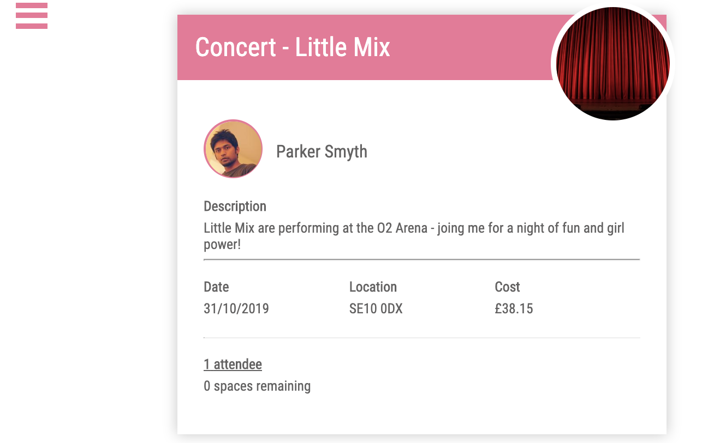

# sei-group-project
a General Assembly project by Sim, Sheema and Tom

This project was made in collaboration with Tom Tidswell (github.com/tomtidswell) and Sheema Khan (github.com/sheemakhan94)

Click to view the live version of the app --->
**[Buddle](https://buddle-app.herokuapp.com/)**

### Technologies used

#### Front-end
* React
* react-burger-menu
* Random users API via the HTTP client Axios.

#### Back-end
* Node.js
* Express - for helping with the routes
* Mongoose - object modelling
* MongoDB - database

### Timeframe

7 days

---

## The Approach
I thought it would be great to build an app created on the idea to use social media to actually socialise. Therefore I came up with the idea of an app which allows people to connect and meet each other to interact in mutual hobbies such as playing sport, or going to an art gallery or even learn languages. The app uses a MERN stack, uses multiple REST routes, and allows secure signup and login.

---

## User Journey

The app opens on the Home Page you can see the burger menu for options to navigate the app, as well as the home screen suggesting categories to browse.


When you click on the Event Index you will see a page of all the possible events, with a category search on the left hand side.

The events are all seeded from the back-end an example of the below from the event model Schema

As we had many seeds files we had to import the event and users  
```
const events1 = require('./seedsDataEvents')
const users1 = require('./seedsDataUsers')
const events2 = require('./seedsEventsSheema')
const users2 = require('./seedsUsersSheema')
```
And then spread them together to come from one database.
```
const eventsData = [...events1, ...events2]
const usersSeed = [...users1, ...users2]
```
Users can click onto the Event Show page which has the details of the event with the attendees, profiles of the attendees and also other contributing factors such as cost, date and location.

Once users are logged in they can also edit their profiles and adjust their photos.

---

## Wins
To finish the project within the time-frame given, with a fully functional app. One thing that certainly stands out when using the app is the user experience, this is reflected in the sleekness of the app.

## Challenges

Due to enormity of the app and the many models it possesses from front and back end, it was difficult to share and arrange work between the group. However after the first few days we really got into the swing of taking control of the workload between ourselves


## Future Developments
Any app has room for improvements, I would suggest the next step for the app would be to build friend requests. When considering joining an event group, the option of friending other attendees or the host should be an option.
